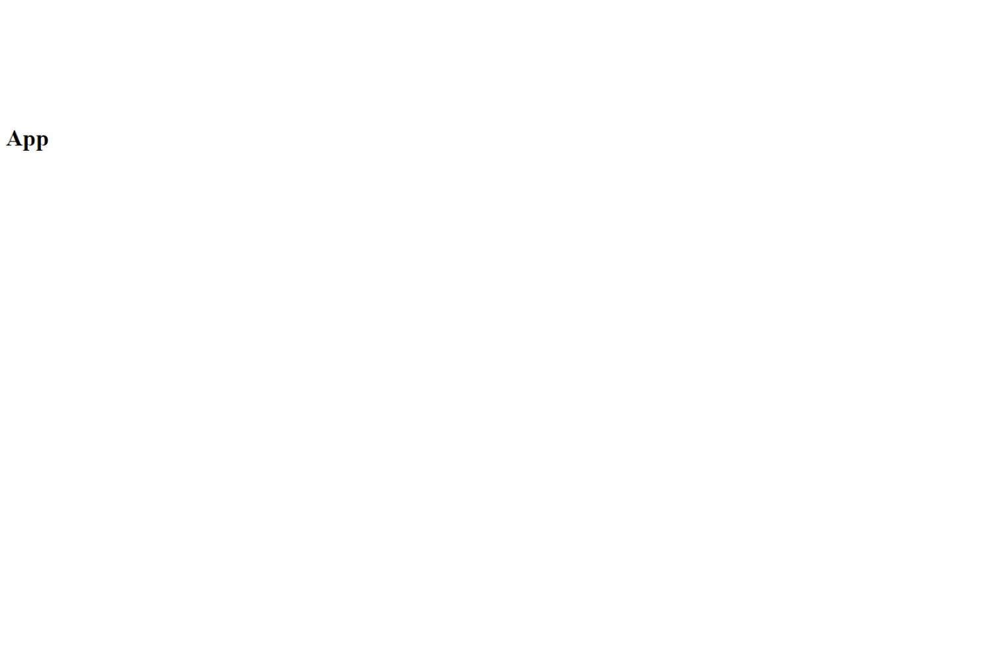

# ToDo List

This project is a simple web application for managing your tasks.

**Preview:**


**Live demo:**
Access the [Live Demo](https://igor-live-demo-todo-list.vercel.app/) or copy the URL directly:
   ```
   https://igor-live-demo-todo-list.vercel.app/
   ```

---

## Project resources

**Core resources:**
- HTML
- TypeScript
- React.js
- Vite.js

**Development support:**
- Git
- PNPM Package Manager
- Biome.js
- Vercel

**Code quality, best practices and extras:**
- Conventional Commits
- Documentation
- Standardized code formatting
- Absolute imports
- Live demo on Vercel

---

## How to use

1. Clone the repository to your computer using the following command:
   ```
   git clone <repository_url>
   ```
2. This project uses the `PNPM` package manager. To install dependencies, run:
   ```
   pnpm install
   ```
3. If you prefer to use a different package manager, delete the `node_modules` and `pnpm-lock.yaml` files in the project root. Then, use the appropriate commands to configure the new package manager.
4. This project uses `Vite.js` as its bundler. To start the development server, run:
   ```
   pnpm dev
   ```
5. Open your web browser and navigate to:
   ```
   http://localhost:3000
   ```
3. If you prefer to use a different server port, open the `vite.config.ts` file located in the root of the project, find the `server` section, and update the `port` value as desired.